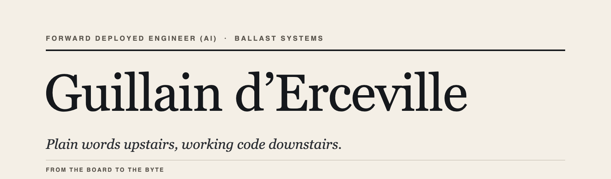

  

I sit in the seat between the people who run a business and the machines it runs on. I take the brief in plain words, from the CEO, and turn it into working systems, in production, with my own hands on the keyboard. Nothing ships that I haven’t checked myself.

Most engineers can either talk to a board or build the thing. The value lives in the seam between the two, and that is where I work.

 

## What I do

**Keep old, critical systems alive while the business keeps running.**
Migrations with no downtime, no rewrite, no surprise. Most recently: a whole company’s only server, twenty years old, no backup of anything, moved to safety on a Saturday night. On Monday, nobody noticed.

**Put AI into production, not into slides.**
Speech and language models with guardrails, measured on real workloads and billed to real clients: a legal-services platform of about 300 people and 900 professional clients, where one wrong word is a legal liability and most of the output leaves without a human touching it.

**Make one engineer count for a team.**
An AI agent in the terminal executes; I decide; everything is verified before it reaches production. Two weeks instead of two months, and the mistakes caught before they cost anything.

**Report upstairs in two sentences anyone can act on.**
Then write the runbook for the person who isn’t me.

 

## Proof, not promises

I publish field notes from real engagements: what the client asked, what I found, the options put on the CEO’s desk, the build, the switch, and what broke after. Numbers, not adjectives. They appear under **[Ballast Systems](https://www.linkedin.com/company/146478074/)**.

 

## Where it comes from

**Ten years as a published security researcher and reverse engineer.** Find the weak assumption, prove it, harden it. The byte-level codec work now going into FFmpeg is the direct descendant of those years.

**A systematic trading fund, built from nothing and run with real money**, up to $9 billion a month in traded volume. On-call for my own stack, five nights a week.

**Microsoft France**, analytics for a $540M division, then a sales quota carried personally. The half of the job that isn’t code: living in the customer’s constraints, then translating them for the people who build.

 

## Built in the open

#### Production AI you can invoice

**[Trusted-Transcription](https://github.com/Guillain-RDCDE/Trusted-Transcription)** · Guardrails for speech-to-text in production: catches the AI’s confident mistakes before a client sees them, and removes their cause. Learned where one wrong word is a legal liability.

#### Locked formats and abandoned hardware, reopened

**[DS2-Anywhere](https://github.com/Guillain-RDCDE/DS2-Anywhere)** · Opens Olympus and Grundig dictation recordings on any computer, a format locked since 1994. Replaced a paid licence and a chain of Windows machines; the fix is going upstream into FFmpeg.

**[dss-codec](https://github.com/Guillain-RDCDE/dss-codec)** · The decoding engine underneath: the closed format reverse-engineered and matched to the original down to the last sample.

**[HAP-Revival](https://github.com/Guillain-RDCDE/HAP-Revival)** · Sony walked away from its high-end music players in 2021. This keeps them alive and improving, on your own network, nothing sent anywhere.

**[OpenJooki](https://github.com/Guillain-RDCDE/OpenJooki)** · Keeps a child’s Jooki speaker working now that the company is gone. Written for parents, not technicians.

**[PocketRoll](https://github.com/Guillain-RDCDE/PocketRoll)** · An endless roll of film for the 1998 Game Boy Camera on modern hardware: a limit removed by reading a format nobody had read.

**[MugDump](https://github.com/Guillain-RDCDE/MugDump)** · Rescues the photos trapped in a Game Boy Camera, straight from your browser.

#### Honest measurement

**[Open-Alpha-Lab](https://github.com/Guillain-RDCDE/Open-Alpha-Lab)** · Hundreds of famous stock-market “winning formulas”, put through one honest protocol by someone who ran the real thing. Almost none survive, and the failures are published too.

**[FLAC Detective](https://github.com/Guillain-RDCDE/FLAC_Detective)** · Catches music sold as lossless that was secretly compressed. It accuses only when independent lines of evidence agree, because a false accusation costs more than a miss.

**[Seedforger](https://github.com/Guillain-RDCDE/Seedforger)** · A complete file-sharing ratio spoofer, shipped with the mathematical proof that no client-side trick can win. Build the thing, then publish why it can’t work.

#### Hearing what your systems are doing

**[Tintinnabulum](https://github.com/Guillain-RDCDE/Tintinnabulum)** · Turns any live stream of events into sound and light, so you hear production instead of only watching dashboards. Runs in a browser, on a phone, with nothing to install.

#### When the infrastructure isn’t there

**[Prometheus-Station](https://github.com/Guillain-RDCDE/Prometheus-Station)** · A solar-powered box that serves all of Wikipedia with no internet and no power grid: a lighthouse for disaster zones and remote places.

 

I publish my dead ends next to my wins. It is the only thing that makes the wins believable.

The platform that pays the bills stays under NDA. I will gladly walk a serious party through how it is built, privately.

 

**Based in France. Open to a Forward Deployed Engineer role in Suisse romande, with the right team, and to engagements through Ballast Systems.**

[guillain@poulpe.us](mailto:guillain@poulpe.us) · [LinkedIn](https://www.linkedin.com/in/guillain-d-erceville) · [Ballast Systems](https://www.linkedin.com/company/146478074/)
